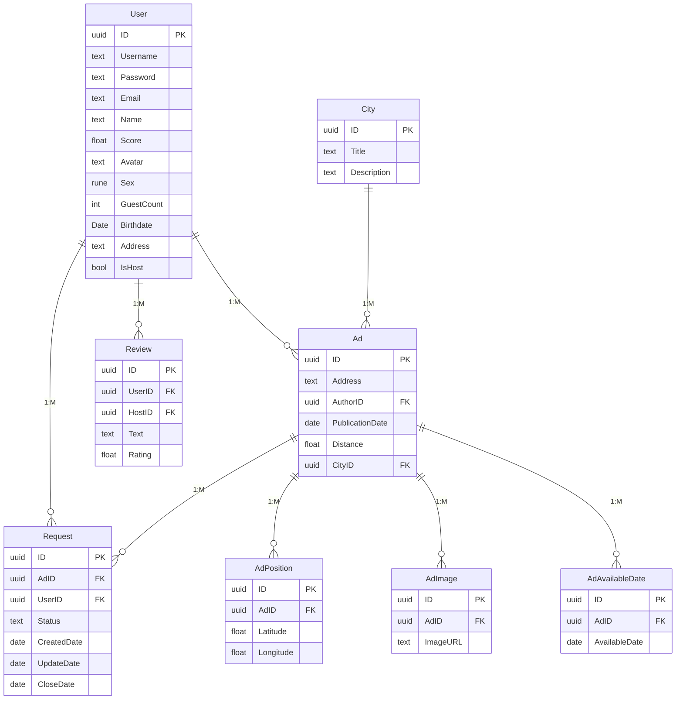

# Структура базы данных

## Схема данных

## Описание таблиц

### AdAvailableDate
Таблица `AdAvailableDate` хранит доступные даты для объявления:
- `ID` - уникальный идентификатор записи.
- `AdID` - идентификатор объявления.
- `AvailableDate` - дата, на которую объявление доступно для заселения.

### AdPosition
Таблица `AdPosition` отвечает за хранение географической позиции жилья:
- `ID` - уникальный идентификатор позиции.
- `AdID` - идентификатор объявления.
- `Latitude` - широта.
- `Longitude` - долгота.

### Ad
Таблица `Ad` представляет объявления о жилье:
- `UUID` - уникальный идентификатор объявления (UUID).
- `CityID` - идентификатор города, в котором находится объявление.
- `AuthorUUID` - идентификатор автора объявления.
- `Address` - адрес объекта недвижимости.
- `PublicationDate` - дата публикации объявления.
- `Distance` - расстояние от пользователя.

### User
Таблица `User` содержит данные пользователей:
- `UUID` - уникальный идентификатор пользователя (UUID).
- `Username` - логин пользователя.
- `Password` - пароль пользователя.
- `Email` - электронная почта пользователя.
- `Name` - имя пользователя.
- `Score` - рейтинг пользователя.
- `Avatar` - путь до файла с аватаркой.
- `Sex` - пол пользователя.
- `GuestCount` - количество гостей, которых принял хозяин.
- `Birthdate` - дата рождения пользователя.
- `IsHost` - флаг, указывающий, является ли пользователь хозяином.

### City
Таблица `City` хранит данные о городах:
- `ID` - уникальный идентификатор города.
- `Title` - название города.
- `Description` - описание города.

### Image
Таблица `Image` хранит информацию о вложенных изображениях к объявлениям:
- `ID` - уникальный идентификатор изображения.
- `AdID` - идентификатор объявления, к которому относится изображение.
- `ImageUrl` - URL изображения.

### Request
Таблица `Request` отвечает за хранение заявок на объявления:
- `ID` - уникальный идентификатор заявки.
- `AdID` - идентификатор объявления, на которое подана заявка.
- `UserID` - идентификатор пользователя, подавшего заявку.
- `Status` - статус заявки.
- `CreatedDate` - дата и время создания заявки.
- `UpdateDate` - дата и время последнего изменения заявки.
- `CloseDate` - дата закрытия заявки.

### Review
Таблица `Review` хранит отзывы:
- `ID` - уникальный идентификатор отзыва.
- `UserID` - идентификатор пользователя, который оставил отзыв.
- `HostId` - идентификатор владельца жилья.
- `Text` - текст отзыва.
- `Rating` - оценка отзыва.

## Нормализация

### Функциональные зависимости

**AdAvailableDate:**
- `{ID} -> AdID, AvailableDate`

**AdPosition:**
- `{ID} -> AdID, Latitude, Longitude`

**Ad:**
- `{UUID} -> CityID, AuthorUUID, Address, PublicationDate, Distance`

**User:**
- `{UUID} -> Username, Password, Email, Name, Score, Avatar, Sex, GuestCount, Birthdate, IsHost`
- `{Username} -> UUID, Password, Email, Name, Score, Avatar, Sex, GuestCount, Birthdate, IsHost`
- `{Email} -> UUID, Username, Password, Name, Score, Avatar, Sex, GuestCount, Birthdate, IsHost`

**City:**
- `{ID} -> Title, Description`

**Image:**
- `{ID} -> AdID, ImageUrl`

**Request:**
- `{ID} -> AdID, UserID, Status, CreatedDate, UpdateDate, CloseDate`

**Review:**
- `{ID} -> UserID, HostId, Text, Rating`

### Проверка нормальных форм:

- **Первая нормальная форма (1NF):**
  Все атрибуты являются атомарными, так что схема удовлетворяет 1NF.

- **Вторая нормальная форма (2NF):**
  Во всех таблицах каждый неключевой атрибут зависит от полного первичного ключа. Следовательно, схема удовлетворяет 2NF.

- **Третья нормальная форма (3NF):**
  Во всех таблицах отсутствуют транзитивные зависимости, поскольку каждый неключевой атрибут зависит только от первичного ключа. Следовательно, схема соответствует 3NF.

- **Нормальная форма Бойса-Кодда (BCNF):**
  Во всех таблицах все функциональные зависимости либо тривиальны, либо ключевые. Следовательно, схема соответствует BCNF.

